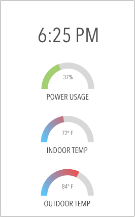
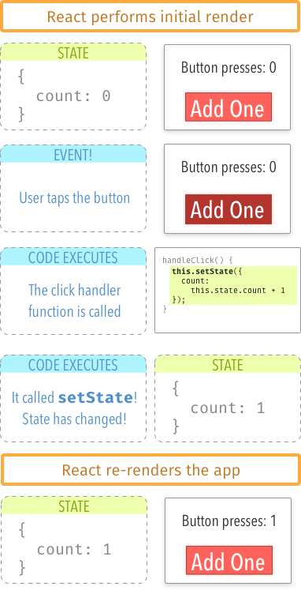

# warmup-week08day02-react-state

## State
<p>State is an object that represents the parts of the app that can change. Each component can maintain its own state, which lives in an object called:</p>

```js 
this.state
```

## What React State Looks Like?

<p>Looking at this image, pick out the parts that could change </p>


## How To Change State?
React knows when you calling ```this.setState``` from inside a component.

- React maintains state as an object
- You can change that object by calling ```setState```
- React will re-render every time you call setState


- You should NOT change ```this.state``` directly, ever. Use ```this.setState```.
- State changes are asynchronous. If you read from ```this.state``` immediately after calling ```this.setState```, it probably won’t reflect the changes yet.


## State Changes in a Counter

- There’s a number displayed, starting off at 0
- You click a button (this causes a call to a handleClick function you designate)
- The counter increments by 1 (you call setState to make this happen)
- React re-renders the app in response to the state change 

